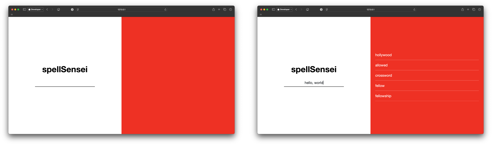

# spellSensei
spellSensei is a lightweight and efficient Python-based spell checker designed to help users identify and correct misspelled words with ease. At its core, spellSensei leverages the Wagner-Fischer algorithm, a dynamic programming approach for calculating the Levenshtein distance between words. This enables the tool to efficiently measure the similarity between strings and suggest accurate corrections for misspelled words. Its lightweight design ensures it can be seamlessly integrated into various applications without compromising performance. Whether you're working on a personal project, integrating it into a larger system, or simply looking to improve text accuracy, spellSensei provides reliable and high-speed suggestions to enhance written communication.

<div style="text-align: center;">
  
</div>

## Features
- **Custom Dictionary**: Load your own word dictionary from a file.
- **Levenshtein Distance**: Utilizes the Wagner-Fischer algorithm to compute the similarity between words.
- **Configurable Suggestions**: Specify the number of suggestions for misspelled words.
- **Simple and Intuitive**: Minimal setup and straightforward usage.

## Prerequisites
- Python 3.6 or higher

## Dictionary File Format
The dictionary file should be a plain text file with one word per line:
```
apple
banana
cherry
```

## How It Works
1. **Load Dictionary**: Words are loaded into memory from the specified file.
2. **Wagner-Fischer Algorithm**: Computes Levenshtein distance between the input word and each dictionary word.
3. **Rank Suggestions**: Words are ranked by their distance to the input word. The closest matches are returned.

## Levenshtein Distance Algorithm
spellSensei employs the Wagner-Fischer algorithm to calculate the Levenshtein distance between two strings. The algorithm works as follows:

1. Initialize a 2D matrix of size `(len(s1) + 1) x (len(s2) + 1)`, where `s1` and `s2` are the input strings.
2. Fill the first row and column of the matrix with incremental values representing insertion and deletion costs.
3. Iterate through each cell in the matrix, calculating the cost of substitution, insertion, and deletion:
   - **Substitution**: If the characters at the current position in both strings match, the cost is 0; otherwise, it is 1.
   - **Insertion**: Cost of adding a character to one of the strings.
   - **Deletion**: Cost of removing a character from one of the strings.
4. Set the value of each cell to the minimum of the three calculated costs.
5. The value in the bottom-right cell of the matrix represents the Levenshtein distance between the two strings.

### Example Implementation
```python
def wagner_fischer(s1, s2):
    len_s1, len_s2 = len(s1), len(s2)
    
    matrix = [[0 for _ in range(len_s2+1)] for _ in range(len_s1+1)]

    for i in range(len_s1+1):
        matrix[i][0] = i
    for j in range(len_s2+1):
        matrix[0][j] = j

    for i in range(1, len_s1+1):
        for j in range(1, len_s2+1):
            cost = 0 if s1[i-1] == s2[j-1] else 1
            insertion, deletion, substitution = matrix[i][j-1]+1, matrix[i-1][j]+1, matrix[i-1][j-1]+cost
            matrix[i][j] = min(insertion, deletion, substitution)

    return matrix[len_s1][len_s2]
```

## Customization
- **Dictionary**: Replace `words.txt` with your own dictionary file.
- **Max Suggestions**: Adjust the default number of suggestions by modifying the `max_suggestions` parameter.

## Limitations
- Performance may degrade with very large dictionaries.
- Handles case sensitivity as-is; ensure your dictionary matches the case format of your input words.

## Contributions
Contributions are welcome! Feel free to open issues or submit pull requests for enhancements or bug fixes.
